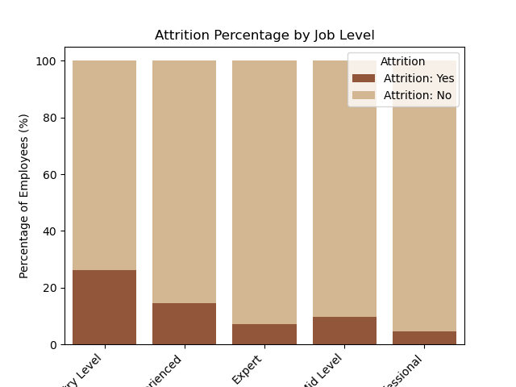
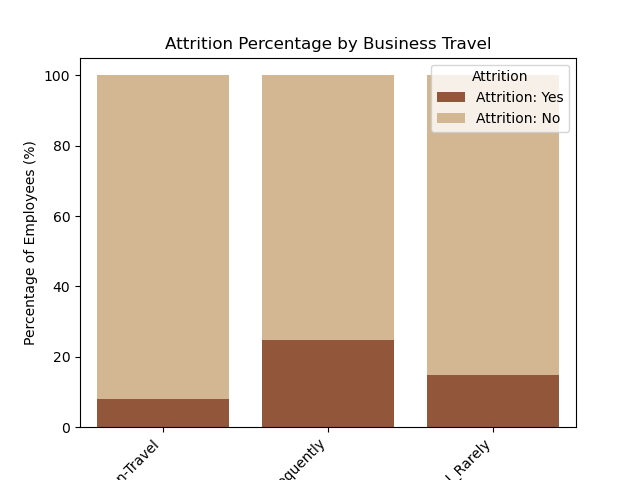

# Employee Attrition _ Prediction Model & Streamlit App Preperation

### Problem

As the lead data engineer for a large enterprise, I am spearheading a collaborative effort with HR to analyze employee attrition trends and develop an advanced predictive application. My primary focus is designing a robust prediction model. To ensure the dataset is analysis-ready, we will employ effective data cleaning techniques. Through the integration of cutting-edge technology and leveraging data-driven insights, our goal is to provide the HR department with a powerful tool for proactive decision-making and effective mitigation of employee attrition.

### Data Dictionary

Definitions for each value set in the data: HERE (https://www.kaggle.com/datasets/patelprashant/employee-attrition)                                

### Executive Summary

In exploring the reasons behind employee departures, I uncovered some noteworthy insights. Notably, attrition rates decreasing as employees progress in their careers, while those who don't travel frequently exhibit greater job stability. Monthly income also emerged as a factor influencing retention. I delved into attrition dynamics across gender, job roles, education, and marital status, employing statistical tools like violin plots and dot scatter analyses. The culmination of this effort resulted in the development of a practical tool using Logistic Regression, a sophisticated computer model, aimed at aiding HR in informed decision-making. To enhance accessibility, we complemented this with a Streamlit app, providing additional visualizations and predictive outcomes.

### Steps Taken: Cleaning, EDA, & Modeling

Commencing with a dataset of 1470 employees and 35 columns, our initial focus was on preparing it for analysis. We simplified the process by adopting lowercase and snakecasing for ease of analysis. Transforming text data into numerical formats was pivotal for data readiness. Subsequently, we explored attrition trends across various parameters such as age, department, job level, monthly income, business travel, gender, job role, marital status, and education. These findings informed strategic decision-making.

The next phase involved model creation. We assessed three models and identified Logistic Regression as the optimal choice, boasting an 87% training accuracy and 85% baseline score, surpassing the baseline score of 83%. The emphasis on models with robust generalization capabilities proved instrumental.

To enhance practicality, we implemented a Streamlit app. This user-friendly application facilitates the visualization of additional charts and predictions based on employee features, enriching our project as a valuable tool for proactive HR decision-making.

### Key Visualizations

Employing scatterplots, violin plots, 100% stacked bar charts, and more, I visually communicate the attrition percentages at various job levels, unraveling significant insights into employee turnover. The most notable were: 

#### Visualization 1:[Attrition Percentages by Job Level]

This visualization highlights distinctive attrition patterns across job levels:

Entry-Level: 25% turnover
Experienced: 15% turnover
Mid-Level: 10% turnover
Professionals: Boasting a low attrition rate, emphasizing the importance of retaining a skilled workforce.
Experts: Displaying an exceptionally low attrition rate, signaling challenges in replacing individuals with specialized skills.

Moreover, the chart reveals a correlation between tenure and job stability, with attrition rates decreasing as employees progress in their careers. The majority choosing to stay in each category underscores a pervasive trend of robust employee retention.

-AND-

#### Visualization 2: [Attrition Percentages by Business Travel]

This 100% stacked bar chart presents attrition rates based on business travel:

Rare Travelers: Approximately 90% retention rate, with a less than 10% attrition rate.
Frequent Travelers: A retention rate around 80%, coupled with a higher attrition rate of about 25%.
Non-Travelers: Demonstrating an exceptionally high retention rate of approximately 95%, with a low attrition rate of about 5%.

These findings accentuate that non-traveling employees exhibit the strongest job stability, followed by rare travels and then frequent travelers. Understanding these dynamics is critical for informed decision-making in workforce management.

### Conclusions/Recommendations

In our examination of attrition patterns, we discovered that certain demographic factors significantly influence employee turnover. Employees with shorter tenures, younger ages, and lower incomes are generally more susceptible to attrition. However, it is imperative to recognize that these are overarching trends, and individual circumstances may deviate from these patterns. Consequently, our recommendations emphasize the importance of tailored retention strategies that consider the unique situations of each employee.

Moving on to departmental insights, diverse patterns emerged across various departments. Sales Reps exhibited a notably high attrition rate, warranting further investigation into the contributing factors. In contrast, Research Directors' teams showcased exceptional stability, indicative of effective practices contributing to a steadfast workforce. HR Professionals experienced notable turnover, pointing to specific challenges within HR departments that require attention. Managers displayed a low attrition rate, underscoring the impact of effective leadership, and suggesting that investing in leadership development initiatives could further enhance stability.

Education levels were found to correlate with attrition rates. Higher education, particularly a doctoral degree, was associated with lower attrition. Additionally, individuals in Professional and Expert roles exhibited lower attrition, emphasizing the significance of retaining a skilled workforce.

Demographic trends further revealed the influence of age, monthly income, and business travel on attrition rates. Non-traveling employees demonstrated robust job stability, while frequent travelers experienced higher attrition.

In terms of modeling performance, our predictive efforts using Logistic Regression yielded compelling results, achieving an accuracy score between 85% and 88%, surpassing the baseline accuracy of 83%.

To enhance ongoing analysis and prediction, we developed a Streamlit app. This tool allows for dynamic exploratory data analysis (EDA) and prediction based on employee features, offering a practical and accessible means for HR decision-making.

### Additional Information

Recommendations:

Focus On:

- Retention Strategies: Tailor retention strategies to address high turnover factors observed in Sales Reps. Consider implementing effective departmental practices seen in Research Directors' teams.

- Leadership Development: Invest in leadership development programs to enhance effective leadership, particularly for Managers, who already demonstrate low attrition.

- Targeted Support for HR Professionals: Investigate and address specific challenges within HR departments to reduce turnover.

- Education and Skill Development: Prioritize support for higher education, correlating with lower attrition. Focus efforts on retaining Professionals and Experts for their valuable contributions.

Prioritize:

- Demographic Considerations: Explore flexible arrangements for frequent travelers to mitigate higher attrition. Provide additional support for younger employees with lower incomes.

- Continuous Monitoring: Regularly monitor attrition trends and adjust strategies accordingly.

- Communication and Feedback: Establish open channels for employee feedback on workplace experiences. Utilize insights from the predictive model for proactive decision-making.

- Utilize Streamlit App: Integrate the developed Streamlit app into regular processes for ongoing analysis and prediction.

